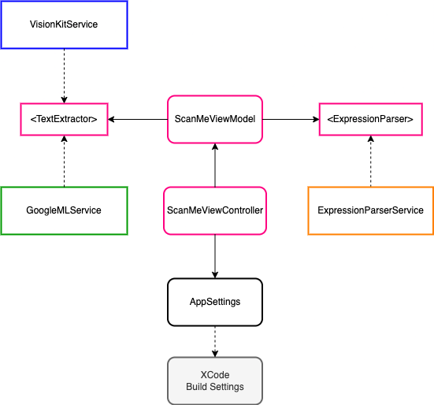

# Scan Me

## Component Dependency Diagram

### **Notes**

#### **Cocoapods**

This project uses Cocoapods version 1.11.3  
Please run *pod install* after cloning.

#### **OCR Libraries Used**

For this project, two OCR libraries were implemented

- Apple VisionKit
  
- Google ML Kit
<https://developers.google.com/ml-kit/vision/text-recognition/ios>

The choice of library can be changed inside the ScanMeComposer class by changing this line:

    vc.viewModel = ScanMeViewModel(textExtractor: VisionKitService(),
                                       parser: ExpressionParserService())
into:

    vc.viewModel = ScanMeViewModel(textExtractor: GoogleMLService(),
                                       parser: ExpressionParserService())

#### **Multiple App Flavors**

To build multiple app flavors from the same codebase, multiple targets were created, each with it's own custom PLIST file. User-defined attributes for Color theme (COLOR_THEME) and image source (IMAGE_SOURCE) were used to set the corresponding properties during compile time.

#### **MVVM**

The project used the MVVM design pattern with Combine to separate logic from UI.

#### **Modularity**

The use of protocol interface achieves a certain amount of modularity such that the main logic is not dependent on the external services e.g. the OCR Service. For example we can replace VisionKit with Google ML Kit without affecting the main logic.
